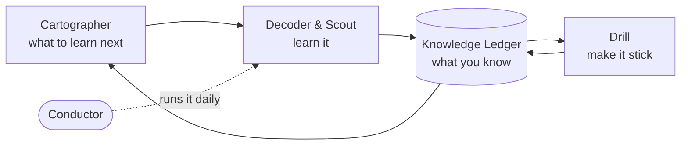

# AI Learning Fleet

**A small team of AI agents that teaches its owner to think like an AI product manager — and runs itself, every day, with no babysitting.**

Most "I'm learning AI" projects are a folder of bookmarks nobody reopens.

This is a *system* instead. A handful of cooperating agents figure out **what** you should learn, teach it **at your level**, make sure it **sticks**, and keep you **current** — automatically.

It was built by a product manager, on [Claude Code](https://www.anthropic.com/claude-code), to get from *"I can follow AI headlines"* to *"I can reason about AI products."* It's also working proof of that journey.

---

## The problem it solves

Learning AI from a non-technical start fails quietly, in two ways:

1. **You don't know what to learn, or in what order.** The field is huge, bookmarks pile up, nothing connects.
2. **What you read doesn't stick.** You get an article on Tuesday and can't explain it by Friday.

The Fleet closes both gaps — deliberately, and with as little willpower as possible.

## The fleet

Each agent does one job. They all share one memory: the **Knowledge Ledger**, a running model of what you know.

| Agent | What it does |
|---|---|
| **Cartographer** | Maps the AI concepts a PM should know, in sensible order, and shows you your blind spots. |
| **Decoder** | Paste any article or link. It explains it at your level: the prerequisites you're missing, the jargon decoded, why it matters for a PM, and a few questions to check you got it. |
| **Scout** | Every morning, pulls your sources, picks the 1–2 most relevant pieces, and digests them into a two-minute brief. |
| **Drill** | Quizzes you with spaced repetition so it sticks. Only marks a concept "known" once you can explain it unaided. |
| **Conductor** | Runs the whole thing on a daily schedule, logs every run, and backs it all up. |
| **Showcase** *(planned)* | Turns your progress into shareable write-ups and a skills-vs-role view. |



No single agent is the point. They **compound**. The more you use it, the more it learns about you, and the better every agent gets at meeting you where you are.

## Why it's different

**A system, not a reading list.** It decides what's next, teaches it, and checks you retained it. The loop closes instead of just growing a pile.

**It learns about you.** Every session updates a shared memory of what you understand. Explanations stop repeating what you already know and focus on your real gaps.

**It runs itself.** One daily job. ~$0 to operate. No servers. It writes your brief, schedules your reviews, and backs itself up — unattended.

## What it feels like to use

- **7:30 a.m.** — a brief lands: two relevant reads, the next concept to learn, how many reviews are due.
- **Five spare minutes** — *learn the next concept*, *quiz me*, or *decode this article*.
- **Over weeks** — your concept map fills in from the foundations up. Ideas move from *seen* → *understood* → *can explain*.

## Under the hood

Deliberately simple, cheap, and robust:

- **Runs on Claude Code** with a personal subscription. ~$0 marginal cost, no servers, no third-party platforms.
- **A shared, human-readable memory** (plain JSON / Markdown, version-controlled) tracks each concept's status, your comprehension level, and its review schedule.
- **Three proven building blocks:** content retrieval (RSS + article extraction), spaced repetition (Leitner scheduling), and safe automation (scheduled runs, file-locked state, graceful per-agent failure handling, nightly auto-commit).
- **42 automated tests**, self-documenting run logs, and a written requirements + plan history in [`docs/`](docs/).

*Concepts exercised: AI product management · agentic workflows · LLMs · RAG · embeddings · semantic search · evaluation · prompt design · retrieval · spaced repetition · automation · Python.*

## Status

**Live and running daily:** Cartographer, Decoder, Scout, Drill, Conductor.
**Planned:** Showcase.

Each agent was shipped and tested before the next was started.

## Run it yourself

```bash
# from the project root, in Claude Code
py -m venv .venv && .\.venv\Scripts\Activate.ps1
pip install -r requirements.txt
python scripts\doctor.py        # health check
```

Then:
- `/map` — see the concept map
- `/next` — learn the next concept
- `/decode <url>` — digest an article
- `/drill` — review what's due

See [`docs/`](docs/) for the full requirements and plan.

---

### What this project demonstrates

*Kept to the end on purpose — the work should speak first.*

It started as a way to learn AI. Building it ended up exercising the core of the product role:

- **Requirement clarity.** It began as a written brief and plan — problem framing, scope boundaries, success criteria, explicit non-goals — before any code. That paper trail is in [`docs/`](docs/).
- **Product thinking.** Sequenced by value and dependency: ship what helps on day one, defer the rest. Hold scope. Build the smallest version that delivers real value.
- **AI fluency.** Embeddings, retrieval/RAG, evaluation, agentic orchestration, prompt design, and the practical build-vs-buy tradeoffs of putting models into a product.
- **Systems judgment.** A self-correcting feedback loop, graceful failure handling, cost control, and "deploy *and maintain*" rather than "demo once."
- **Communication.** Explaining technical ideas at the reader's level — which is, after all, the entire product.

Built and run by **Likitha Madala**.
