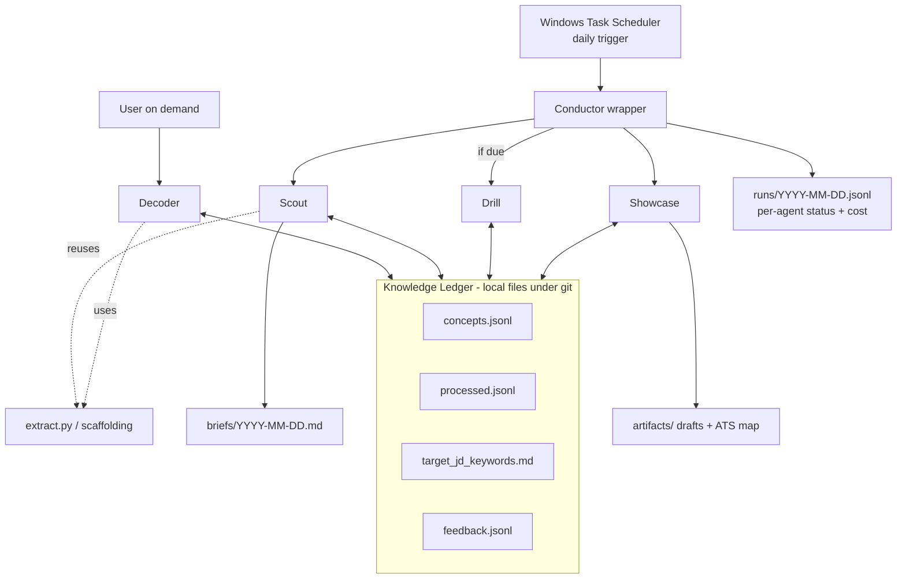

# feat: AI Learning Agent Fleet

**Target project:** `ai-learning-fleet/` — a new greenfield directory. All paths below are relative to that project root. No existing repo; `git init` is part of U1.

## Summary

Build a five-agent fleet on Claude Code that compounds the user's daily AI literacy and doubles as interview proof. Agents share a local Knowledge Ledger and run unattended via Windows Task Scheduler. Deterministic Python helpers do fetching/parsing; the model does only reasoning. Ship in build order — Decoder first, Conductor last — so each agent delivers value before the next exists.

---

## Problem Frame

The user is a non-technical PM stalled at the bottom of the AI-literacy ladder. Two recurring failures: a **discovery gap** (no sense of what to read or in what order) and a **comprehension tax** (missing prerequisite context turns every article into a tab-spiral, so it gets abandoned). Generic intent slips because nothing makes the next step concrete, calibrated to current level, or self-reinforcing. The cost is a literacy gap that blocks daily work and credibility in interviews where AI fluency is now table stakes. See origin: `docs/brainstorms/2026-06-16-ai-learning-agent-fleet-requirements.md`.

---

## Requirements

Carried from the origin document. R-IDs preserved for traceability.

**Knowledge Ledger**
- R1. A single shared state records concepts encountered, a comprehension level per concept, recurring gaps, and target-role JD keywords.
- R2. Every agent reads the Ledger before acting and writes updates after acting.
- R3. Scaffolding depth is calibrated from the Ledger — known concepts are not re-explained.

**Decoder**
- R4. Accepts a URL or pasted text and returns missing prerequisites, an inline jargon glossary, an ELI5 explanation, a "why it matters for a PM" framing, and 3 recall questions.
- R5. Calibrates that output to the user's current level using the Ledger.
- R6. Logs covered concepts and flagged gaps back to the Ledger.

**Scout**
- R7. Runs on a daily schedule with no manual trigger.
- R8. Pulls from a user-defined source set and filters items to the user's current rung and target role.
- R9. Pre-scaffolds the top one to two items and delivers a brief to the chosen surface.
- R10. Records delivered items and a streak signal to the Ledger.

**Drill**
- R11. Selects concepts due for review from the Ledger on a spaced-repetition cadence.
- R12. Quizzes the user, adapts difficulty to responses, and re-teaches missed concepts.
- R13. Updates per-concept comprehension level in the Ledger from quiz results.

**Showcase**
- R14. Generates shareable artifacts from Ledger activity: a weekly "what I learned in AI" post draft and at least one teardown or explainer.
- R15. Maintains an ATS keyword map of claimable AI skills against target job descriptions.
- R16. Flags gaps between target-JD keywords and demonstrated knowledge as priorities fed back to Scout and Drill.
- R17. Never auto-publishes; the user reviews and edits every artifact before it goes out.

**Conductor**
- R18. A single scheduled run fires the daily sequence: Scout → Ledger update → Drill scheduling → Showcase drafting.
- R19. Produces a run log of what each agent did, usable as a status surface and an interview artifact.
- R20. Degrades gracefully — a failure in one agent does not block the others.

**Cross-cutting**
- R21. Each agent is independently runnable and demoable before the Conductor exists.
- R22. The system runs at negligible cost; demos require no paid infrastructure.

---

## Key Technical Decisions

- **KTD1. Subscription auth, API key unset in the scheduled context.** Run scheduled agents on the Claude subscription via a long-lived `CLAUDE_CODE_OAUTH_TOKEN` (from `claude setup-token`), and guarantee `ANTHROPIC_API_KEY` is unset in the Task Scheduler environment — it overrides the OAuth token and silently routes runs to per-token API billing (a documented four-figure failure mode). This makes R22 real. Verify with `claude /status` showing subscription, not API. The token is long-lived but not eternal: record its expected TTL and a renewal step in `config/invocation.md`, and have `run_agent.ps1` detect an auth-failure exit code and log a clear "OAuth token expired — re-run `claude setup-token`" message rather than failing opaquely. `--bare` is deliberately not used for these runs (see KTD4) because it bypasses OAuth.
- **KTD2. No third-party hosting — fully local.** Claude Code CLI + Windows Task Scheduler + local files + git, all on the user's machine. No servers, no PaaS, no managed queue. Optional free GitHub remote as offsite Ledger backup only.
- **KTD3. Ledger as plain files under git, not a database.** Per-concern Markdown + JSONL files (human-readable, diff-friendly, revertible). The scheduled Conductor runs its agents sequentially, but the on-demand Decoder can fire while the Conductor is running, so concurrency is real: each Ledger mutation takes a **file lock** around read-modify-**atomic-write** (temp file + rename). The lock serializes writers so no update is lost; the atomic rename prevents truncation on crash. Commit after each Conductor run for free history. SQLite is deferred — adopt only if querying becomes painful (which also implies FSRS; see KTD5).
- **KTD4. Standard invocation shape for every agent.** Plain `claude -p` (which honors the logged-in subscription session per KTD1), with explicit `--allowedTools` and `--permission-mode` so an unattended run never aborts on a prompt, `--output-format json` for the cost/session summary, and `--output-format stream-json --verbose` for the full trace. Do **not** use `--bare`: it reads auth strictly from `ANTHROPIC_API_KEY`/apiKeyHelper and never reads the OAuth token, which would break KTD1. Because plain `claude -p` does not auto-load each agent's prompt or Ledger context deterministically, pass them explicitly — the agent prompt via `--append-system-prompt-file`, the Ledger via `--add-dir`/file references — and shape Ledger writes with `--json-schema`.
- **KTD5. Spaced repetition = Leitner boxes (v1).** Fixed-interval boxes (1, 3, 7, 14, 30 days): correct advances a box, wrong resets to box 1. Zero math, stores as `box` + `next_due` per concept, keeps the Ledger file-friendly. SM-2 is the optional smoother upgrade; FSRS is deferred (needs a review-history store and hundreds of reviews to pay off).
- **KTD6. Content pipeline = `feedparser` + `trafilatura`, paste fallback.** A single helper (`extract.py`) wraps both: `feedparser` for feed discovery (its `id`/`guid` drives idempotency) and `trafilatura` for article-text extraction to Markdown. When extraction yields too little text (paywalled/JS-heavy), surface the paste prompt rather than fighting the paywall — Decoder's pasted-text path. Playwright escalation is deferred. Deterministic Python helpers fetch/parse; the model only reasons. Extracted article text is **untrusted**: wrap it in explicit delimiters and instruct the model (system preamble) to treat delimited content as data, never instructions, so a malicious article cannot inject Ledger writes.
- **KTD7. Model tiering.** A cheaper daily-driver model (Sonnet-class) for high-frequency, low-reasoning agents (Scout filtering, Drill scheduling); a frontier model (Opus-class) for Decoder's deep explanations. Keeps subscription-window usage and any API fallback cost down.
- **KTD8. Observability local-first; Langfuse deferred (optional).** Per-run JSONL traces + `total_cost_usd` + `session_id` captured locally are the v1 observability surface; `claude --resume <session_id>` replays a bad run. Langfuse is a recommended later enhancement (prompt versioning + LLM-as-judge scoring of generated content, and a strong interview signal), explicitly out of v1 scope to preserve the zero-cost/zero-maintenance posture.
- **KTD9. Scout delivery = local dated Markdown brief (v1).** Lowest-friction, lowest-maintenance surface, matches the file-based substrate. Email/messaging delivery is deferred.
- **KTD10. Drill runs in two modes.** The unattended Conductor run only *selects and notifies* due concepts (recording them to the brief/run log); the interactive quiz-and-re-teach session (R12) is a separate user-triggered Drill run, since a one-shot `claude -p` on a possibly-not-logged-on schedule cannot conduct an adaptive back-and-forth.
- **KTD11. Calibration self-check in v1.** Because the value claim is calibrated output (R5, R12), v1 observability includes a cheap standing check — assert known concepts are not re-explained and flag suspected mis-calibration to the run log — rather than deferring all quality signal to the Langfuse LLM-as-judge tier (KTD8).
- **KTD12. Secret and PII hygiene.** The OAuth token and any `.env`/Task-Scheduler-XML never enter git (KTD2 `.gitignore` + a U1 guard test); `runs/` logs (carrying `session_id`) are git-ignored. If the optional GitHub remote is enabled it must be **private** — `jds/` and the Ledger hold career-sensitive data (skill gaps, target employers).

---

## High-Level Technical Design

The Conductor is the only scheduled entry point. It invokes each agent as its own `claude -p` subprocess (failure isolation), and every agent reads and writes the shared Ledger. Decoder is also invokable on its own, on demand.



**Two feedback loops the design supports:**
- *Learning loop:* consume (Decoder/Scout) → Ledger updates comprehension → Drill recall test → Showcase detects JD gaps → priorities written back to the Ledger steer tomorrow's Scout/Drill. (R3, R10, R13, R16.)
- *Agent-tuning loop:* user reviews outputs → appends a note to `ledger/feedback.jsonl` → agents read it at run start → user iterates prompts. Langfuse scoring is the deferred heavier form (KTD8).

---

## Output Structure

```
ai-learning-fleet/
  agents/
    decoder.md            # agent prompt + instructions
    scout.md
    drill.md
    showcase.md
  scripts/
    ledger.py             # atomic read-modify-write helpers for the Ledger
    extract.py            # feedparser discovery + trafilatura extraction, feed dedup, paste fallback
    schedule.py           # Leitner box logic
    run_agent.ps1         # invocation wrapper: env, claude -p, capture output
    conductor.ps1         # orchestrates the daily sequence
  ledger/
    concepts.jsonl        # {id, term, comprehension, box, next_due, last_seen, source}
    processed.jsonl       # {url_or_guid, date, agent}  (idempotency)
    target_jd_keywords.md
    feedback.jsonl        # user notes the agents read at run start
  sources/feeds.opml      # user-curated feed list
  jds/                    # user-supplied target job descriptions
  briefs/                 # Scout output (dated)
  artifacts/              # Showcase drafts + ATS map
  runs/                   # per-run traces + cost logs
  config/invocation.md    # documented standard claude -p flag set
  tests/                  # pytest for Python helpers
  README.md
  requirements.txt        # feedparser, trafilatura
  .gitignore              # ignores *.env, *token*, *secret*, Task Scheduler XML, runs/; tracks ledger/
```

The tree is a scope declaration, not a constraint; per-unit `**Files:**` are authoritative.

---

## Implementation Units

### U1. Project scaffold, runtime, and auth foundation

- **Goal:** Greenfield skeleton, Python helper environment, and the subscription-auth + invocation conventions that make every later run free and deterministic.
- **Requirements:** R20, R21, R22
- **Dependencies:** none
- **Files:** `README.md`, `requirements.txt`, `.gitignore`, `config/invocation.md`, `scripts/run_agent.ps1`, directory skeleton from Output Structure
- **Approach:** `git init`. Document and script the standard invocation shape (KTD4) once in `config/invocation.md` and `run_agent.ps1`: plain `claude -p` (no `--bare`), `--output-format json`/`stream-json --verbose`, explicit `--allowedTools` + `--permission-mode`, context passed via `--append-system-prompt-file`/`--add-dir`. Establish the auth setup (KTD1): one-time `claude setup-token`, store `CLAUDE_CODE_OAUTH_TOKEN` in the scheduled task's environment, ensure `ANTHROPIC_API_KEY` is unset there, and record the token TTL + renewal step. `run_agent.ps1` captures each run's JSON summary (`session_id`, `total_cost_usd`) and stream trace into `runs/`, and detects an auth-failure exit code to log a clear token-expired message. Define `.gitignore` contents per KTD12.
- **Patterns to follow:** Claude Code headless docs; PowerShell `*>` for all-stream capture.
- **Test scenarios:**
  - A `claude -p --output-format json` smoke run returns a `total_cost_usd` field and a `session_id`.
  - `claude /status` confirms subscription auth (not API) in the scheduled-task environment.
  - `run_agent.ps1` writes both a JSON summary and a stream trace to `runs/` for one invocation.
  - A file matching `*token*`, `*.env`, or `*secret*` cannot be staged — the `.gitignore` guard holds (KTD12).
  - Test expectation: smoke/manual verification — this unit is configuration and scaffolding, no behavioral logic.
- **Verification:** A manual `run_agent.ps1` invocation completes, bills the subscription, and leaves trace + cost artifacts in `runs/`.

### U2. Knowledge Ledger schema and atomic read/write helper

- **Goal:** The shared state spine all agents depend on.
- **Requirements:** R1, R2, R3
- **Dependencies:** U1
- **Files:** `scripts/ledger.py`, `ledger/concepts.jsonl`, `ledger/processed.jsonl`, `ledger/target_jd_keywords.md`, `ledger/feedback.jsonl`, `tests/test_ledger.py`
- **Approach:** Per-concern files (KTD3). `concepts.jsonl` records `{id, term, comprehension, box, next_due, last_seen, source}`; `processed.jsonl` records `{url_or_guid, date, agent}`. `ledger.py` exposes read, upsert-concept, set-comprehension, mark-processed, is-processed, and append-feedback — each acquiring a file lock around read-modify-atomic-write (temp + rename) so the on-demand Decoder and the scheduled Conductor cannot lose each other's updates (KTD3). Calibration helper returns concepts marked known so callers can skip re-explaining (R3).
- **Patterns to follow:** JSONL append-friendly records; atomic temp-file rename.
- **Test scenarios:**
  - Upserting a new concept appends one record; upserting an existing term updates in place without duplicating.
  - Setting comprehension on a concept persists the new level and leaves others untouched.
  - `is_processed` returns true after `mark_processed` for the same canonical URL/guid, false for a new one.
  - A simulated crash mid-write (exception before rename) leaves the prior file intact — no truncation.
  - Two interleaved read-modify-write cycles on `concepts.jsonl` (the Decoder-vs-Conductor case) both persist — the lock prevents a lost update.
  - The calibration helper excludes a concept flagged known from the "needs explanation" set.
  - After `append_feedback` writes a note, a subsequent read returns it; two appends produce two distinct records.
- **Verification:** `pytest tests/test_ledger.py` passes; manual inspection shows clean, diff-friendly JSONL.

### U3. Decoder agent and content extraction helper

- **Goal:** Relieve the comprehension tax on day one — the first shippable, demoable agent.
- **Requirements:** R4, R5, R6, R21 (Flow F1)
- **Dependencies:** U2
- **Files:** `agents/decoder.md`, `scripts/extract.py`, `tests/test_extract.py`
- **Approach:** Input is a URL or pasted text. `extract.py` uses `feedparser`/`trafilatura` to fetch and extract article text to Markdown (KTD6); below a min-length threshold it signals the paste fallback instead of returning thin content. The Decoder prompt then produces prerequisites, an inline glossary, ELI5, a PM framing, and exactly 3 recall questions, calibrated to the Ledger (R5), and writes covered concepts + gaps back (R6). Use the frontier model tier (KTD7).
- **Patterns to follow:** `trafilatura` Markdown output; Ledger calibration helper from U2.
- **Test scenarios:**
  - `Covers F1.` A URL with extractable content returns all five output sections plus exactly 3 recall questions.
  - A paywalled/JS-heavy URL (extraction under threshold) triggers the paste-fallback prompt rather than thin output.
  - Pasted raw text bypasses extraction and scaffolds directly.
  - A concept already marked known in the Ledger is not re-explained in the prerequisites/glossary.
  - After a run, covered concepts and any flagged gaps appear in `concepts.jsonl`.
- **Verification:** Decoder run on a real article produces a calibrated scaffold and updates the Ledger; paste path works on a paywalled page.

### U4. Scout agent, feed ingestion, and daily brief

- **Goal:** Close the discovery gap and create the daily habit.
- **Requirements:** R7, R8, R9, R10
- **Dependencies:** U2; U3 (shares its `extract.py` helper and scaffolding pattern — does not invoke the Decoder agent as a subprocess)
- **Files:** `agents/scout.md`, `sources/feeds.opml`, `briefs/` (output), `tests/test_extract.py` (extends U3's with feed-pull cases)
- **Approach:** `extract.py` (from U3, extended with a `fetch_feeds(opml)` function) pulls entries via `feedparser`, dedups against `processed.jsonl` by `id`/`guid` (KTD6 idempotency), and returns the top-N new items; the same helper then runs `trafilatura` extraction (with the U3 min-length/paste-fallback handling) on each selected item so Scout scaffolds full article text, not feed summaries. The Scout prompt filters to the user's rung + target role (from the Ledger), reuses the U3 scaffolding pattern directly (not a Decoder subprocess, which would multiply per-run cost), and writes a dated Markdown brief to `briefs/` (KTD9). Records delivered items + a streak signal to the Ledger. Cheaper model tier (KTD7).
- **Patterns to follow:** `extract.py` + scaffolding from U3; `processed.jsonl` dedup from U2.
- **Test scenarios:**
  - A scheduled invocation runs with no manual trigger and produces a dated brief.
  - Already-processed entries are excluded on the next run (idempotency holds).
  - Filtering drops items irrelevant to the configured target role.
  - Selected items are run through `trafilatura` extraction before scaffolding — no scaffolding on bare feed summaries.
  - The brief contains at most the top-N (1–2) scaffolded items.
  - Delivered items are marked processed and the streak signal increments in the Ledger.
- **Verification:** Two consecutive Scout runs show no duplicate items; a brief lands in `briefs/` and the Ledger reflects the delivery.

### U5. Drill agent and Leitner scheduling

- **Goal:** Convert reading into retained knowledge.
- **Requirements:** R11, R12, R13
- **Dependencies:** U2
- **Files:** `agents/drill.md`, `scripts/schedule.py`, `tests/test_schedule.py`
- **Approach:** `schedule.py` implements Leitner box logic (KTD5): select concepts with `next_due` ≤ today, compute box transitions and the next due date. Drill runs in two modes (KTD10): in the unattended Conductor run it only selects due concepts and notes them in the brief/run log; the interactive quiz — adapt difficulty, re-teach misses, update `box`/`next_due`/`comprehension` (R12, R13) — is a separate user-triggered run. Cheaper model tier (KTD7).
- **Patterns to follow:** Leitner fixed intervals (1/3/7/14/30); Ledger update helpers from U2.
- **Test scenarios:**
  - Only concepts with `next_due` ≤ today are selected for review.
  - A correct answer advances the box and pushes `next_due` to the longer interval.
  - A wrong answer resets to box 1 with a near-term `next_due`.
  - Comprehension level is updated from quiz results.
  - An empty due-set produces a graceful no-op (no error, nothing written).
- **Verification:** `pytest tests/test_schedule.py` passes; a manual Drill session updates boxes and due dates correctly.

### U6. Showcase agent, ATS keyword map, and gap feedback

- **Goal:** Turn learning exhaust into interview/ATS evidence and close the learning loop.
- **Requirements:** R14, R15, R16, R17
- **Dependencies:** U2
- **Files:** `agents/showcase.md`, `jds/` (input), `artifacts/` (output), `tests/test_showcase_ledger.py`
- **Approach:** From Ledger activity, generate a weekly "what I learned in AI" post draft and at least one teardown/explainer (R14). Build an ATS keyword map of claimable skills vs. the user's target JDs in `jds/` (R15). Flag JD-vs-knowledge gaps and write them back to the Ledger as priorities that steer Scout/Drill (R16, the learning loop). Write drafts only — never publish (R17).
- **Patterns to follow:** Ledger read for activity history; gap write-back via `ledger.py`.
- **Test scenarios:**
  - A post draft is generated from real Ledger activity (references concepts actually learned).
  - At least one teardown/explainer artifact is produced.
  - The ATS keyword map shows claimable skills mapped against a supplied JD.
  - Detected gaps are written back to the Ledger as priorities.
  - Output is drafts only — nothing is posted or sent (review gate intact).
- **Verification:** Showcase run produces review-ready drafts + a keyword map; Ledger shows new priority entries.

### U7. Conductor orchestrator, run logging, and scheduling

- **Goal:** Tie the fleet into one daily run — the "fleet I deploy and maintain" headline.
- **Requirements:** R18, R19, R20 (Flow F2)
- **Dependencies:** U3, U4, U5, U6
- **Files:** `scripts/conductor.ps1`, `scripts/run_agent.ps1` (update), `runs/` (output), `config/invocation.md` (Task Scheduler notes)
- **Approach:** A single scheduled run invokes Scout → Ledger update → Drill scheduling/notify only (if due; KTD10) → Showcase drafting, each as its own `claude -p` subprocess wrapped in try/catch with exit-code checks so one content failure doesn't block the rest (R20). It distinguishes a rate-limit/auth exit code from a content failure: on subscription-cap or auth exhaustion (a correlated failure) it aborts the remaining sequence and records the reason rather than treating it as isolated. Runs the KTD11 calibration self-check, writes a consolidated `runs/YYYY-MM-DD.jsonl` with per-agent status + `total_cost_usd` (R19), then `git commit` the Ledger. Register the Windows Task Scheduler task: run as the user with "run whether logged on or not," set the "Start in" directory, absolute interpreter paths.
- **Patterns to follow:** `run_agent.ps1` from U1; per-agent subprocess isolation.
- **Test scenarios:**
  - `Covers F2.` A daily run fires Scout, then Drill scheduling (if due), then Showcase, in order.
  - A forced failure in one agent (nonzero exit) does not stop the others; the run completes.
  - A rate-limit/auth exit aborts the remaining sequence and logs the reason — not treated as an isolated per-agent failure.
  - The run log records per-agent status and cost for every agent.
  - The Task Scheduler task triggers at the configured time and uses the correct working directory.
  - The Ledger is committed after a successful run.
- **Verification:** A scheduled Conductor run completes end-to-end, isolates an injected failure, and leaves a complete run log + a Ledger commit.

---

## Phased Delivery, Effort & Value Unlock

Effort is expressed as **hands-on build sessions with Claude Code doing the implementation** (a session ≈ 1–2 focused hours), not solo-coding time. Ranges assume some prompt iteration per agent. Total ≈ **7–13 sessions (~12–19 hours)**, comfortably spread over 2–4 weeks. These are planning estimates, not commitments — actual time depends on how much prompt tuning each agent needs.

| Phase | Units | Effort | Value unlocked | Demo moment | Interview signal |
|---|---|---|---|---|---|
| A | U1, U2, U3 | 3–5 sessions (~5–8h) | Comprehension tax gone — paste any article, get a calibrated scaffold; the Ledger starts learning you | Live Decoder run on a hard article | "I built a memory/personalization layer that calibrates explanations to what I already know" |
| B | U4 | 1–2 sessions (~2–3h) | Discovery gap closed; daily brief + streak makes it a habit | A dated morning brief | "I run a scheduled agent that curates and pre-digests my reading" |
| C | U5, U6 | 2–3 sessions (~3–5h) | Retention via spaced recall + interview evidence (post drafts + ATS keyword map) | A live Drill quiz; the ATS map vs. a real JD | "My learning auto-produces portfolio artifacts and a skills-vs-JD gap map" |
| D | U7 | 1–2 sessions (~1–2h) | The fleet: one scheduled run orchestrates all agents with isolated failures + run logs | The run log + Task Scheduler firing daily | "I architected and operate a multi-agent system with orchestration, failure isolation, and cost/trace logging" |

**Per-unit effort:** U1 ~1–2 (auth + Task Scheduler is the fiddly part), U2 ~1, U3 ~1–2 (extraction + paste fallback + prompt tuning), U4 ~1–2, U5 ~1 (Leitner is trivial), U6 ~1–2 (prompt-heavy), U7 ~1–2.

**Critical path:** U1 and U2 gate everything — build and verify them first. Confirm subscription auth (KTD1) before any agent run; a wrong auth setup is the one mistake that costs money rather than time.

**Value-sequencing rationale:** each phase is independently demoable and useful on its own (R21), so value front-loads — Phase A alone solves the daily pain, and every later phase adds a distinct interview signal without depending on the next existing.

---

## Day-1 Fast Path (launch in ~24h)

Goal: a usable on-demand Decoder tomorrow with a **rough Ledger that self-corrects through use** — not a perfect cold-start. The hardest part (cold calibration) is deliberately dropped; the feedback loop earns accuracy over 2–3 days of normal use.

**Key simplification:** the on-demand Decoder runs in the normal logged-in Claude Code session, so the entire scheduling/unattended-auth surface (Task Scheduler, OAuth-for-unattended, the `--bare`/billing concern in KTD1/KTD4) **does not apply on Day 1** — it only matters when Scout/Conductor arrive.

**In the Day-1 slice:**
- **U1-min** — project dir + Python env + git only. No Task Scheduler, no unattended-auth setup.
- **U2-min** — `concepts.jsonl` + `feedback.jsonl` + `processed.jsonl` with append/upsert + atomic write. The file lock (KTD3) is deferred until a second concurrent agent exists.
- **U3 Decoder** + a **~5-min bootstrap interview** that seeds the Ledger roughly (rung, a few known/unknown topics, target-role keywords).
- **Self-learning loop (ships Day 1, non-negotiable):** each run reads the Ledger → writes covered concepts + inferred comprehension → captures a **1-line feedback signal** (too shallow / just right / too deep + optional note) to `feedback.jsonl` → writes a `stream-json` trace to `runs/`. Feedback is read at the next run's start. A tiny `doctor` check verifies Ledger/auth health.

**Deferred past Day 1** (unchanged from the main plan): the file lock; Scout + scheduling/unattended auth (U4); Drill (U5); Showcase + ATS map (U6); Conductor (U7); the richer calibration self-check and Langfuse (a light KTD11 check ships Day 1).

**To start, the user provides:** a target role / 1–2 JDs (rough is fine), ~5 minutes for the bootstrap interview at first run, and a commitment to the 1-line feedback ritual (the loop depends on it). **Outcome bar:** paste an article → get a scaffold that kills the tab-spiral → the run records what was learned + the user's correction.

**Re-sequenced phasing:**
- **Day 1** — U1-min + U2-min + U3 (Decoder + bootstrap + feedback loop).
- **Phase B′** — harden: add the file lock to U2, then Scout (U4) + scheduling/unattended auth.
- **Phase C′** — Drill (U5) + Showcase (U6), buildable in parallel.
- **Phase D′** — Conductor (U7).

---

## Dependencies / Prerequisites

- Claude Code CLI with an active Claude subscription; one-time `claude setup-token`.
- Python 3.x with `feedparser` and `trafilatura` (`requirements.txt`).
- git installed; optional free GitHub remote for Ledger backup.
- Windows Task Scheduler (win32 environment).
- User-supplied inputs: a feed list (`sources/feeds.opml`) and target job descriptions (`jds/`).

---

## Observability & Evaluation

- **v1 (local, free):** per-agent JSONL traces (`stream-json --verbose`) + `total_cost_usd` + `session_id` in `runs/`; debug a bad run by reading the trace or `claude --resume <session_id>`. Conductor writes one consolidated per-run status log.
- **Cost tracking:** log median and p99 `total_cost_usd` per agent over time; a p99 spike flags a runaway loop. A simple "halt if today's spend > $X" guard is trivial from the JSON output even on API billing.
- **Calibration check (KTD11):** a standing assertion that known concepts are not re-explained and that comprehension ratings move with quiz results; suspected mis-calibration is flagged to the run log. This is the v1 quality guard for R5/R12; Langfuse LLM-as-judge is the deferred richer form.
- **Deferred (optional) — Langfuse:** prompt versioning + LLM-as-judge scoring of generated content, plus a searchable trace UI. Recommended once the fleet is running; also a strong interview signal. Out of v1 scope (KTD8).

---

## Cost Per Run

- **Subscription auth (KTD1): effectively $0 marginal** — usage governed by the plan's rolling window and weekly cap, not per-token charges. This is the intended operating mode.
- **Cap contention (watch):** the daily fleet draws on the same subscription window as the user's own Claude work; model tiering (KTD7) and bounded top-N keep the draw small, and the Conductor aborts + logs on cap exhaustion (U7) rather than failing silently mid-sequence.
- **API-billing fallback (not recommended):** with model tiering (KTD7), a single Decoder call ≈ 1–5 cents; a full daily Conductor run ≈ $0.05–0.20/day. Estimates; the `total_cost_usd` field gives exact per-run figures.

---

## Risks & Mitigations

- **Auth misconfiguration → API billing surprise.** Mitigate: verify `claude /status` shows subscription; keep `ANTHROPIC_API_KEY` unset in the scheduled environment; add the spend-guard from Observability. (KTD1.)
- **Content extraction fails on paywalled/JS pages.** Mitigate: min-length threshold → paste fallback; defer Playwright. (KTD6.)
- **Ledger corruption.** Mitigate: atomic writes, per-concern file split, git commit after each run. (KTD3.)
- **Task Scheduler doesn't fire / wrong working dir.** Mitigate: run as user with stored creds (not SYSTEM), set "Start in", absolute paths. (U7.)
- **Scope creep across five agents.** Mitigate: staged build; each agent ships and demos independently before the next. (Phased Delivery, R21.)
- **Subscription cap / rate-limit exhaustion** during an unattended run — a correlated failure R20's per-agent isolation won't catch. Mitigate: model tiering + bounded top-N; Conductor distinguishes the rate-limit/auth exit and aborts+logs the tail. (U7, KTD7.)
- **OAuth token expiry/revocation** silently kills the fleet (no API-key fallback by design). Mitigate: record TTL + renewal; `run_agent.ps1` detects auth failure and logs a token-expired message. (KTD1.)
- **Prompt injection** from untrusted article text writing the Ledger. Mitigate: delimiter-wrap extracted content + untrusted-data preamble. (KTD6.)
- **Lost Ledger updates** under concurrent on-demand Decoder + scheduled Conductor. Mitigate: file lock around read-modify-write. (KTD3.)
- **Career-sensitive data exposure** if the GitHub remote is public. Mitigate: remote must be private; secrets and `runs/` git-ignored. (KTD2, KTD12.)

---

## Scope Boundaries

**Deferred for later** (from origin)
- Conductor orchestration until at least two agents exist (sequenced as Phase D).
- Multi-surface delivery for Scout (email/messaging) — v1 is the local brief.
- Auto-publishing of Showcase artifacts.

**Deferred to Follow-Up Work** (plan-local)
- Langfuse observability/eval tier.
- SM-2 or FSRS spaced-repetition upgrade.
- Playwright extraction escalation.
- Derived SQLite index if Ledger querying becomes painful.

**Outside this product's identity** (from origin)
- Not a full-stack web app — no front end to build or host.
- Not a generic chatbot or a learning product for other people.
- Not the portfolio app clones from the source research (built separately via Lovable).

---

## Open Questions

**Deferred to Implementation**
- Exact min-length threshold for the paste-fallback trigger (tune against real articles).
- Top-N value for Scout's daily brief (start at 1–2).
- Concrete Leitner intervals if the defaults (1/3/7/14/30) feel off in use.
- Initial feed list and first target JDs (user-supplied at U4/U6).
- Whether the non-technical user can operate Task Scheduler setup and trace-debugging unaided, or needs a one-time guided setup (and a `doctor` helper script that checks auth/schedule/token health) — an operability gap relative to the "self-maintained fleet" framing.

---

## Sources & Research

- Origin requirements: `docs/brainstorms/2026-06-16-ai-learning-agent-fleet-requirements.md`.
- Claude Code headless/CLI docs (invocation shape, `--bare`, output formats, permissions).
- Documented `claude -p` API-billing incident (motivates KTD1).
- `claude setup-token` / `CLAUDE_CODE_OAUTH_TOKEN` precedence over `ANTHROPIC_API_KEY` (KTD1).
- Windows Task Scheduler unattended-run guidance ("Start in", run-as-user, PATH).
- Multi-agent local persistence patterns — Markdown/JSONL over SQLite for single-user (KTD3).
- Spaced-repetition comparison: Leitner vs. SM-2 vs. FSRS (KTD5).
- `feedparser` + `trafilatura` extraction stack with paste fallback (KTD6).
- LLM cost-tracking practice: median/p99 per agent run (Observability).
